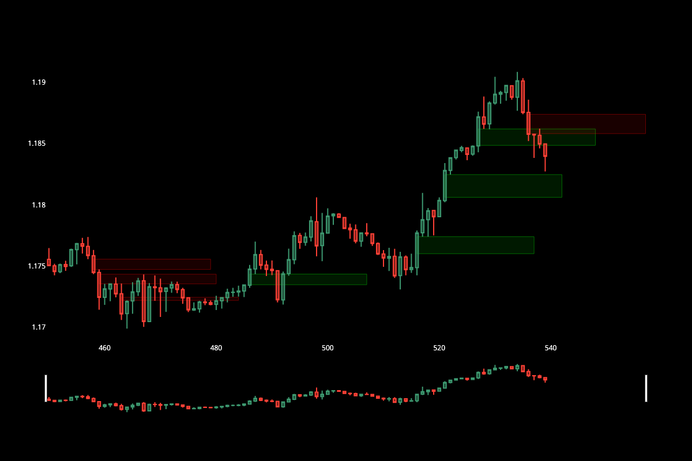

# FVG (Fair Value Gap) Indicator for Trading 💰



[](https://www.python.org/)
[](https://pandas.pydata.org/)
[](https://plotly.com/)
[](https://opensource.org/licenses/MIT)
 
## Overview 📖

This project implements a Fair Value Gap (FVG) detection algorithm for financial market analysis. FVGs are important technical analysis tools that help identify potential price reversals and continuation patterns in the market.

## Features 🌟

- Detects both bullish and bearish Fair Value Gaps
- Processes OHLC (Open, High, Low, Close) candlestick data
- Interactive visualization of price charts with highlighted FVGs
- Configurable parameters for FVG detection
- Support for different timeframes

## Installation 📦
```bash
Clone the repository
git clone https://github.com/pakagronglb/fvg-indicator.git
```

## Navigate to the project directory
```bash
cd fvg-indicator
```

## Create and activate virtual environment
```bash
python -m venv venv
source venv/bin/activate # On Windows use: venv\Scripts\activate

Install required packages
pip install -r requirements.txt
```
## Usage

```python
import pandas as pd
from fvg_indicator import detect_fvg

# Load your OHLC data
df = pd.read_csv("your_data.csv")

# Detect FVGs
df['FVG'] = detect_fvg(df)

# Visualize the results
# See example notebook for visualization code
```

## Parameters 📝

The FVG detection algorithm accepts the following parameters:

- `lookback_period`: Number of candles to look back for average body size (default: 10)
- `body_multiplier`: Multiplier to determine significant body size (default: 1.5)

## Example 📝

Check out the [example notebook](fvg_indicator.ipynb) for a complete demonstration of the FVG indicator in action.

## Requirements 📝

- Python >= 3.12
- pandas
- plotly
- nbformat >= 4.2.0
- ipykernel >= 5.1.2
- ipywidgets

## License 📝

This project is licensed under the MIT License - see the [LICENSE](LICENSE) file for details.

## Contributing 🤝

1. Fork the repository
2. Create your feature branch (`git checkout -b feature/AmazingFeature`)
3. Commit your changes (`git commit -m 'Add some AmazingFeature'`)
4. Push to the branch (`git push origin feature/AmazingFeature`)
5. Open a Pull Request

## Acknowledgments 🤝

- Inspired by the concept of Fair Value Gaps in technical analysis
- Built with Python and modern data science libraries
- Based on ["Automate Fair Value Gap Detection in Python for Algorithmic Trading"](https://www.youtube.com/watch?v=cjDgibEkJ_M) by [CodeTrading](https://www.youtube.com/@CodeTrading)